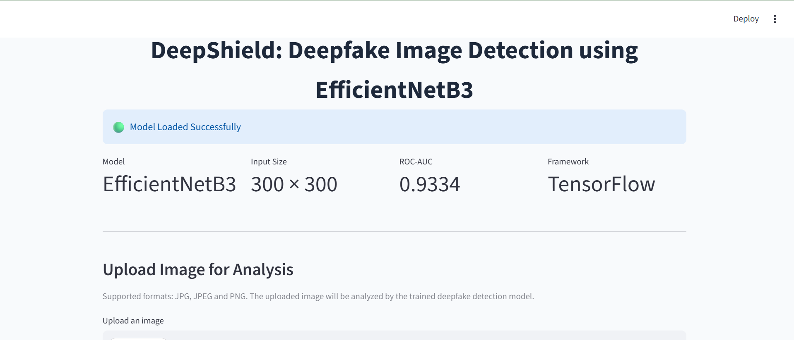
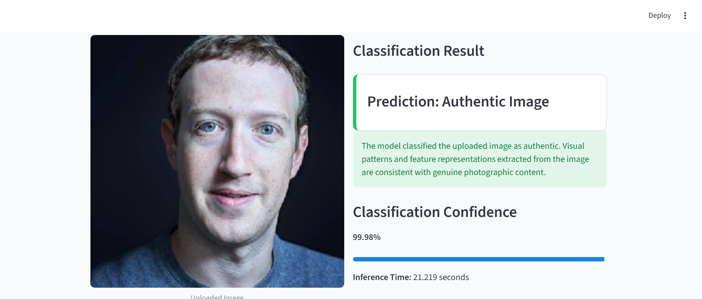
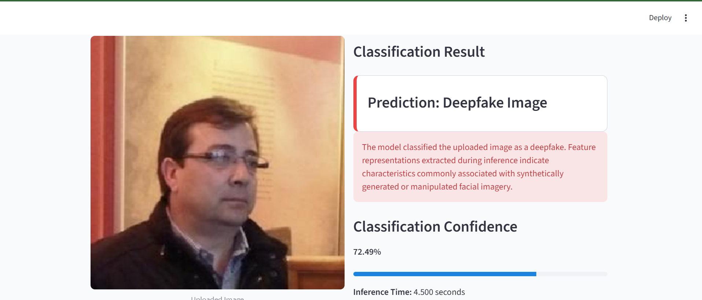

# DeepShield: Deepfake Image Detection using EfficientNetB3

## Overview

DeepShield is a deep learning-based image forensics system developed to detect manipulated and AI-generated facial images (deepfakes). The project leverages transfer learning with EfficientNetB3 and a two-stage training strategy to improve model robustness and generalization across multiple datasets.

The trained model is integrated into a Streamlit web application that allows users to upload an image and receive an authenticity prediction in real time.

---

## Features

* Deepfake image detection using Deep Learning
* Transfer Learning with EfficientNetB3
* Two-stage training for improved generalization
* Real-time image classification
* Confidence score generation
* Interactive Streamlit web interface
* Fast inference and prediction results
* Binary classification of Authentic and Deepfake images

---

## Application Screenshots

### Home Interface



### Authentic Image Detection



### Deepfake Detection Result



---

## Methodology

### Stage 1: Transfer Learning

The model was initially trained using transfer learning on the following dataset:

**Deepfake vs Real Images (20K Dataset)**

Dataset:
https://www.kaggle.com/datasets/prithivsakthiur/deepfake-vs-real-20k

EfficientNetB3 pretrained on ImageNet was used as the feature extraction backbone. The model learned discriminative facial features from authentic and manipulated images.

### Stage 2: Fine-Tuning for Generalization

To improve robustness and reduce dataset-specific bias, the trained model was further fine-tuned on:

**Deepfake and Real Images Dataset**

Dataset:
https://www.kaggle.com/datasets/manjilkarki/deepfake-and-real-images

This second training stage exposed the model to additional deepfake generation techniques and image distributions, enhancing its ability to generalize to previously unseen samples.

---

## Model Architecture

* Base Network: EfficientNetB3
* Input Resolution: 300 × 300 Pixels
* Transfer Learning: ImageNet Pretrained Weights
* Output Layer: Sigmoid Binary Classifier
* Framework: TensorFlow / Keras

### Classification Logic

| Sigmoid Score | Prediction      |
| ------------- | --------------- |
| Score < 0.5   | Authentic Image |
| Score ≥ 0.5   | Deepfake Image  |

---

## Performance Metrics

The model was evaluated on an independent test set containing **10,905 images**.

### Test Results

| Metric            | Value          |
| ----------------- | -------------- |
| Test Accuracy     | 79.81%         |
| ROC-AUC Score     | 0.9334         |
| Test Samples      | 10,905         |
| Base Architecture | EfficientNetB3 |
| Input Resolution  | 300 × 300      |

### Classification Report

| Class               | Precision | Recall | F1-Score |
| ------------------- | --------- | ------ | -------- |
| Authentic Image (0) | 0.73      | 0.95   | 0.82     |
| Deepfake Image (1)  | 0.92      | 0.65   | 0.76     |

| Overall Metric            | Value |
| ------------------------- | ----- |
| Accuracy                  | 0.80  |
| Macro Average F1-Score    | 0.79  |
| Weighted Average F1-Score | 0.79  |

### Confusion Matrix

| Actual / Predicted | Authentic | Deepfake |
| ------------------ | --------- | -------- |
| Authentic          | 5190      | 302      |
| Deepfake           | 1900      | 3513     |

### Performance Analysis

The model achieved a **ROC-AUC score of 0.9334**, demonstrating strong discriminative capability between authentic and manipulated images. Although the overall accuracy reached **79.81%**, the high ROC-AUC indicates that the model effectively separates the two classes across varying classification thresholds.

The model achieved **95% recall for authentic images** and **92% precision for deepfake detection**, indicating strong performance in identifying manipulated content while maintaining a low false-positive rate.

*Performance values were obtained after transfer learning on the Deepfake vs Real Images (20K) dataset followed by fine-tuning on the Deepfake and Real Images dataset.*

---

## Project Workflow

1. User uploads an image.
2. Image is resized to 300 × 300 pixels.
3. EfficientNetB3 extracts deep visual features.
4. Binary classifier predicts image authenticity.
5. Confidence score is generated.
6. Results are displayed through the Streamlit interface.

---

## Technology Stack

### Machine Learning

* TensorFlow
* Keras
* EfficientNetB3
* NumPy

### Frontend & Deployment

* Streamlit

### Development Tools

* Python
* Jupyter Notebook
* Visual Studio Code

---

## Streamlit Application

The trained model is deployed through a Streamlit web application that provides a simple and interactive interface for image analysis.

### Functionalities

* Upload JPG, JPEG, and PNG images
* Real-time deepfake detection
* Confidence score visualization
* Inference time measurement
* Model output probability display
* System information panel

---

## Installation

### Clone the Repository

```bash
git clone https://github.com/saifsiddiqui861/DeepFake-Image-Classifier.git
cd DeepShield
```

### Install Dependencies

```bash
pip install -r requirements.txt
```

### Download the Trained Model

The trained model is hosted separately due to GitHub storage limitations.

**Model Download**

[Download DeepShield Model](https://www.kaggle.com/models/saifsiddiqui123/deepfake-model)

Place the downloaded model file in the project root directory:

```text
DeepShield/
│
├── app.py
├── deepfake_modelv2.keras
├── requirements.txt
└── README.md
```

The application expects the model file to be named:

```text
deepfake_modelv2.keras
```

### Run the Application

```bash
streamlit run app.py
```

The application will be available at:

```text
http://localhost:8501
```

---

## Project Structure

```text
DeepShield/
│
├── .gitattributes
├── .gitignore
├── README.md
├── requirements.txt
├── app.py
│
├── DeepFake_classifier.ipynb
└── deepfake-classifierv2.ipynb
```

### File Description

| File                        | Description                                                |
| --------------------------- | ---------------------------------------------------------- |
| app.py                      | Streamlit web application for real-time deepfake detection |
| DeepFake_classifier.ipynb   | Initial model development and experimentation notebook     |
| deepfake-classifierv2.ipynb | Fine-tuning and model improvement notebook                 |
| requirements.txt            | Project dependencies                                       |
| README.md                   | Project documentation                                      |
| .gitignore                  | Git ignore configuration                                   |
| .gitattributes              | Git repository attributes                                  |

---

## Future Enhancements

* Deepfake video detection
* Explainable AI using Grad-CAM visualizations
* Mobile application deployment
* Multi-class manipulation detection
* Cloud-based inference API
* Support for emerging deepfake generation techniques

---

## Disclaimer

This project has been developed for academic and research purposes. Predictions generated by the model should not be considered definitive proof regarding the authenticity of an image. The system is intended to assist in deepfake detection and should be used alongside other verification methods.

---

## Author

**Saif Siddiqui**
